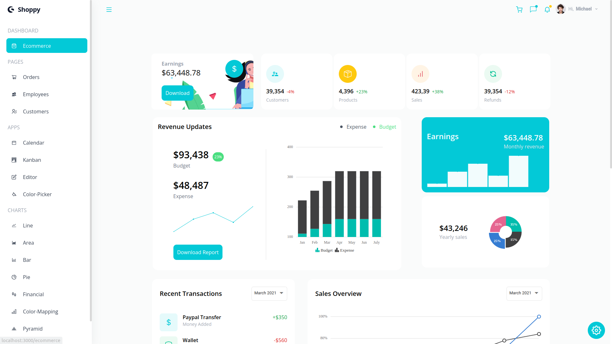
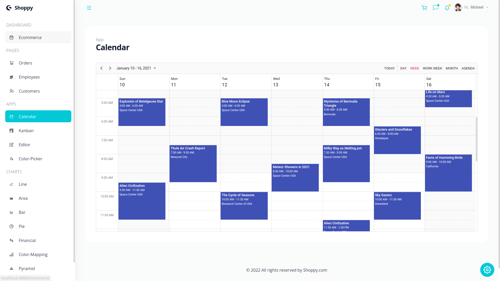
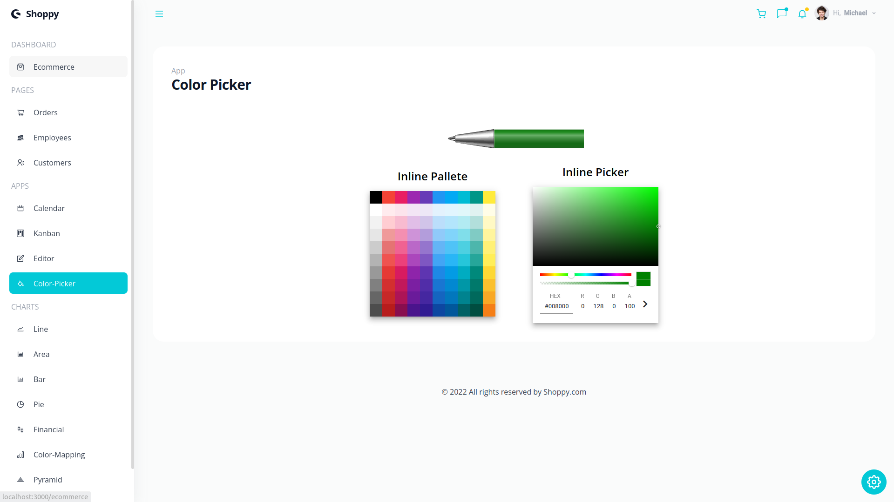
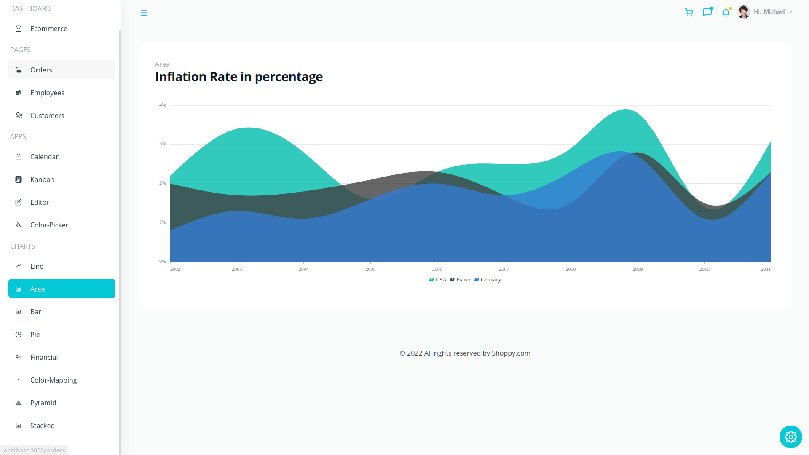
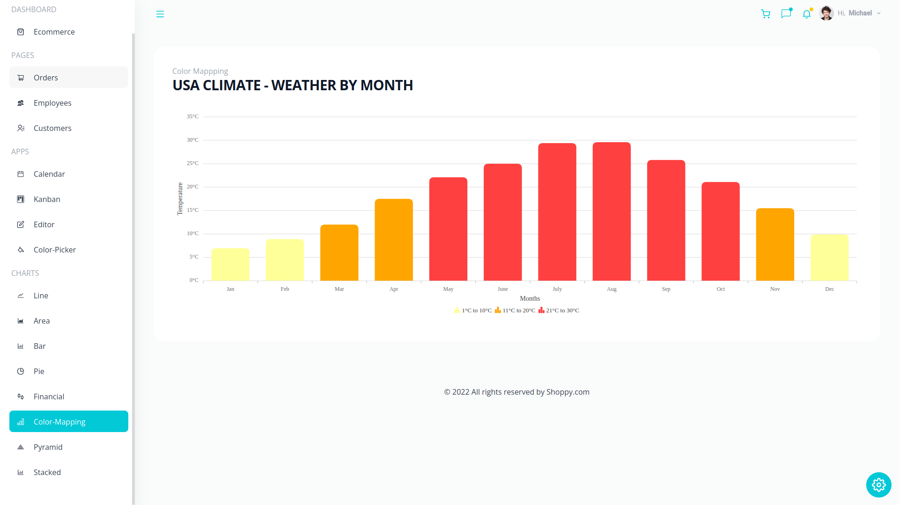
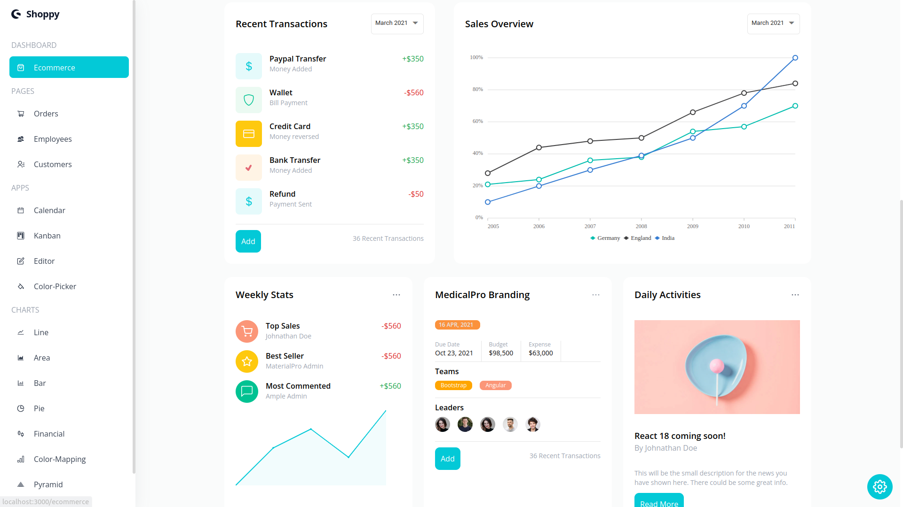

# Syncfusion Dashboard

> Dashboard, created with Syncfusion, React and Tailwind CSS.

- Major languages: JavaScript
- Framework: React
- Tools used: Syncfusion, Tailwind
## Screenshots

### Home

### Calendar App

### Color picker App

### Area Chart

### Color Mapping Chart

### E-commerce Dashboard

## Live Link

You can view the current deployment by clicking the link bellow:

[Live Link](https://yuriy-dashboard.netlify.app/)
### Deployment

- Using [Netlify](https://netlify.com)
## Author

👤 **Yuriy Chamkoriyski**

- GitHub: [@Hombre2014](https://github.com/Hombre2014)
- Twitter: [@Chamkoriyski](https://twitter.com/Chamkoriyski)
- LinkedIn: [axebit](https://linkedin.com/in/axebit)

## 🤝 Contributing

Contributions, issues, and feature requests are welcome!

Feel free to check the [issues page](https://github.com/Hombre2014/Dashboard/issues).

## Show your support

Give a ⭐️ if you like this project!

## Acknowledgments

Thanks to JavaScript Mastery for inspirational [video](https://www.youtube.com/watch?v=jx5hdo50a2M).
## 📝 License

This project is [MIT](./license.md) licensed.
